# MonEndo

**Ta douleur, noir sur blanc.** MonEndo aide les personnes atteintes d'endométriose à suivre leur quotidien (douleurs, cycle,
symptômes, traitements, activité, bilan du jour) et à arriver à leurs rendez-vous médicaux avec un récit clair, sous la forme
d'un PDF de synthèse.

Application en production : <https://monendoapp.fr>

## Principes

- **Mobile d'abord** : chaque écran est pensé pour un téléphone (375 px), le desktop l'enrichit ensuite. Saisie en un ou deux
  gestes, états vides qui proposent une action.
- **Des faits, pas des diagnostics** : MonEndo montre ce qui a été noté (moyennes, évolutions, repères) sans score, sans
  interprétation médicale et **sans aucune prédiction** (ni de prochaines règles, ni de crise). Le ton reste calme et non anxiogène.
- **Données de santé = données sensibles** : minimisation, cloisonnement strict par utilisatrice, consentement explicite,
  export et suppression du compte en libre-service (voir [Confidentialité](#confidentialité-et-sécurité)).
- **Gratuit, sans publicité**, hébergé en Europe.

## Aperçu

Captures réalisées avec des **données fictives** (un mois de suivi simulé), au format mobile.

<table>
  <tr>
    <td align="center" width="25%"><br><sub><b>Bienvenue</b><br>première visite</sub></td>
    <td align="center" width="25%">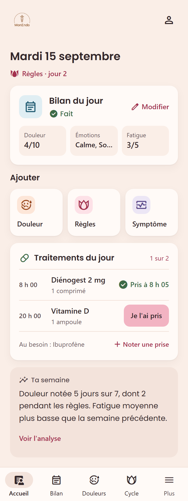<br><sub><b>Accueil « Aujourd'hui »</b><br>cycle, bilan, traitements, semaine</sub></td>
    <td align="center" width="25%">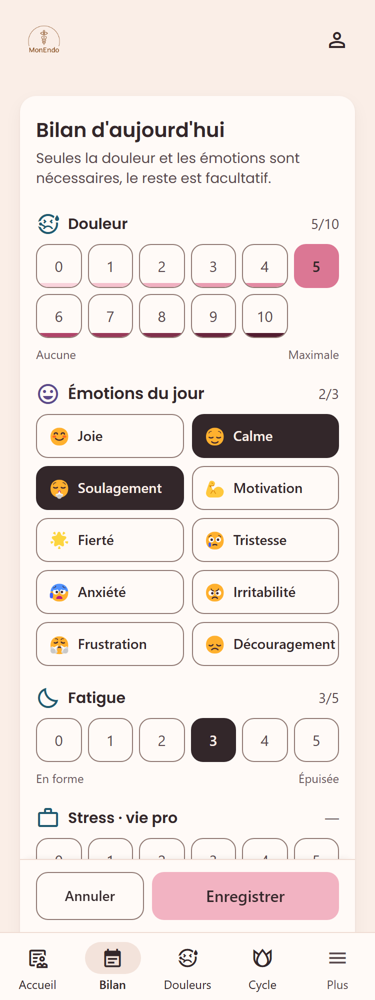<br><sub><b>Bilan du jour</b><br>douleur et émotions, le reste est facultatif</sub></td>
    <td align="center" width="25%">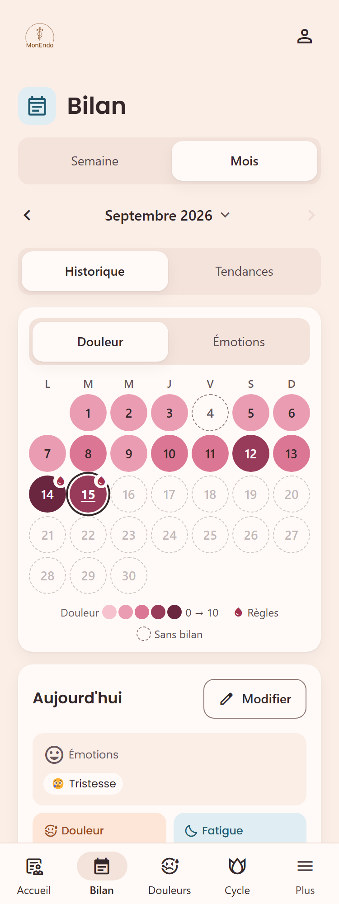<br><sub><b>Historique du bilan</b><br>calendrier, semaine ou mois</sub></td>
  </tr>
  <tr>
    <td align="center">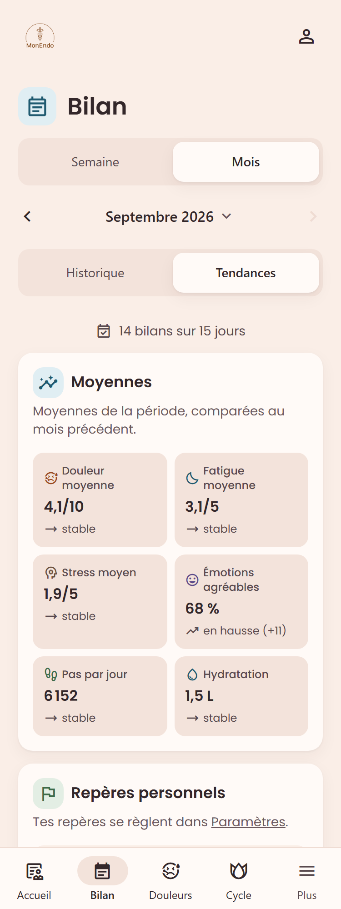<br><sub><b>Tendances</b><br>moyennes et évolution</sub></td>
    <td align="center">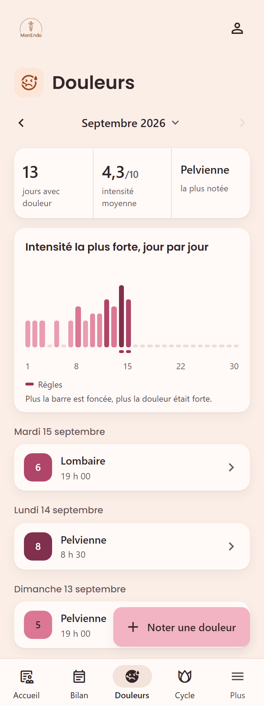<br><sub><b>Douleurs</b><br>graphique jour par jour</sub></td>
    <td align="center">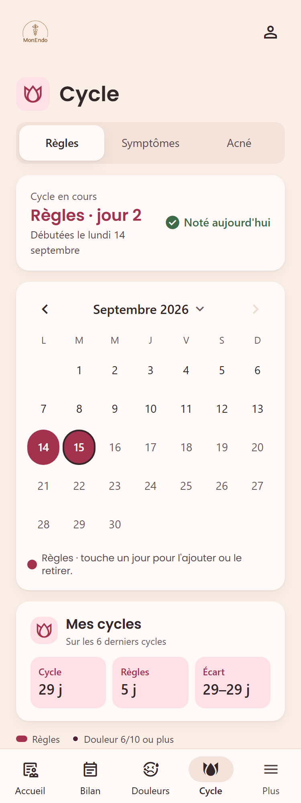<br><sub><b>Cycle</b><br>règles, historique des cycles</sub></td>
    <td align="center">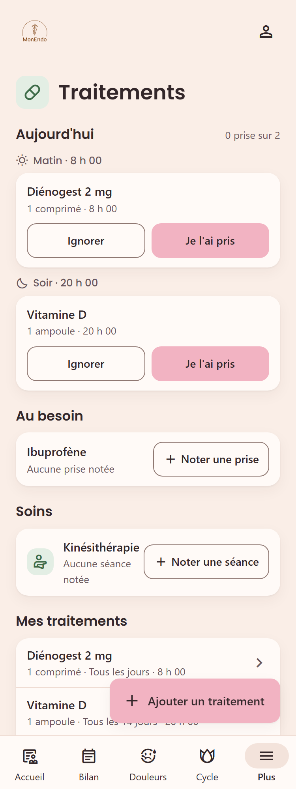<br><sub><b>Traitements</b><br>prises prévues, au besoin, soins</sub></td>
  </tr>
  <tr>
    <td align="center">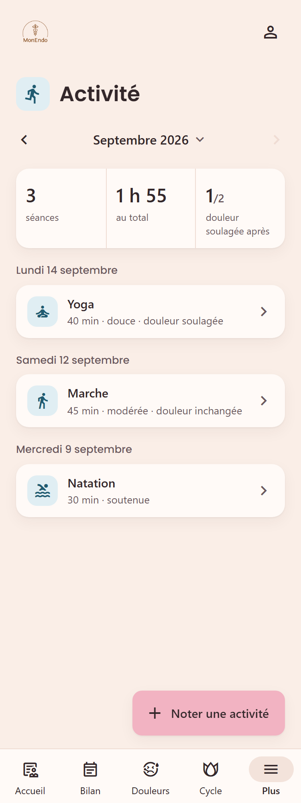<br><sub><b>Activité</b><br>séances et effet sur la douleur</sub></td>
    <td align="center">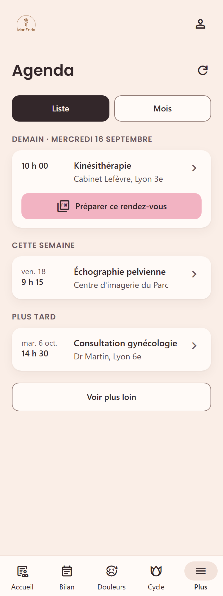<br><sub><b>Agenda</b><br>rendez-vous à venir (Google Agenda)</sub></td>
    <td align="center">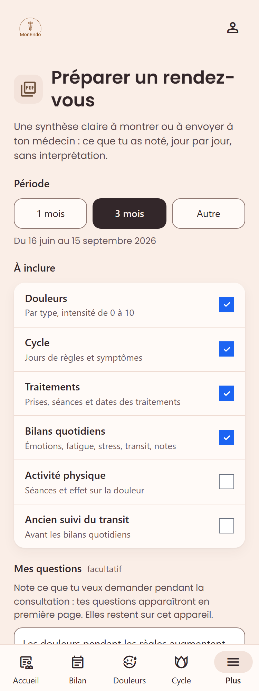<br><sub><b>Préparer un rendez-vous</b><br>période, rubriques, questions</sub></td>
    <td></td>
  </tr>
</table>

Sur ordinateur, la navigation passe dans une barre latérale et les pages gagnent de la place :

<table>
  <tr>
    <td align="center" width="50%">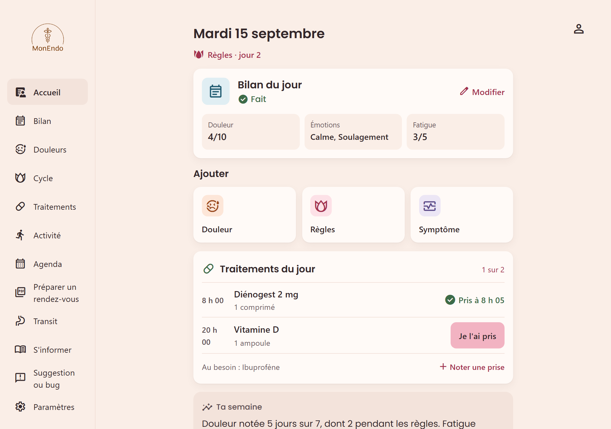<br><sub><b>Accueil</b></sub></td>
    <td align="center" width="50%">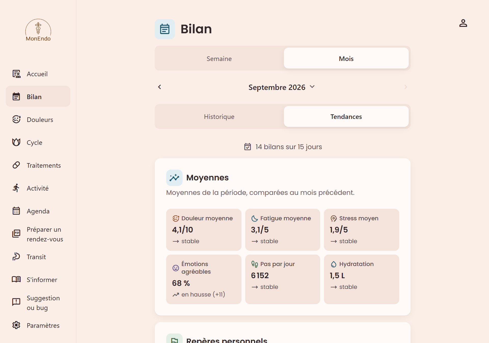<br><sub><b>Tendances du bilan</b></sub></td>
  </tr>
</table>

## Fonctionnalités

### Suivi au quotidien
- **Accueil « Aujourd'hui »** : jour de règles ou du cycle, bilan du jour (à faire ou son résumé), ajout rapide d'une douleur,
  des règles ou d'un symptôme, prises de traitement prévues ce jour-là (notées en un geste), prochain rendez-vous et quelques
  faits descriptifs de la semaine.
- **Bilan quotidien** : une saisie en un écran où seules la douleur (0 à 10) et les émotions (1 à 3 parmi dix) sont obligatoires ;
  stress (vie pro et perso), fatigue, pas, hydratation, alimentation, notes et une catégorie **transit** facultative (selles avec
  échelle de Bristol, crampes d'estomac, ballonnements) sont facultatifs et jamais comptés pour 0 quand ils ne sont pas renseignés.
  Un seul bilan par jour. L'historique se lit par semaine ou par mois (calendrier coloré selon la douleur ou les émotions, détail
  du jour, jours de règles), et l'onglet **Tendances** donne moyennes, évolution par rapport à la période précédente, repères
  personnels atteints et observations factuelles sur la douleur et les règles, sans note ni score.
- **Douleurs** : type, intensité 0-10, moment et commentaire ; chiffres du mois, graphique de l'intensité la plus forte jour par
  jour avec les règles en repère, saisie rapide depuis le bas de l'écran.
- **Cycle** (onglets *Règles*, *Symptômes*, *Acné*) :
  - *Règles* : le cycle en cours, un calendrier où un toucher ajoute ou retire un jour de règles, et l'historique des cycles
    (durée moyenne du cycle et des règles, écart entre le plus court et le plus long, jours de douleur forte), sans prédiction ;
  - *Symptômes* : saisie rapide, regroupés par jour ;
  - *Acné* : un épisode dure de « L'acné revient » à « Ça s'est calmé », plus rien à noter chaque jour ; photo de suivi
    hebdomadaire, comparaison avant / après sur 1, 3 ou 6 mois et historique des épisodes.
- **Traitements** : à la manière de l'app Santé d'Apple, chaque traitement a sa fréquence (tous les jours, certains jours de la
  semaine, tous les N jours, au besoin) et jusqu'à six horaires. La page ne montre que les prises prévues aujourd'hui, à noter
  « Pris » ou « Ignorer » (et à annuler). Traitements au besoin, soins non médicamenteux (kiné, ostéo…), traitements terminés et
  **historique de chaque traitement mois par mois**.
- **Activité physique** : séances du mois par jour, intensité ressentie sur trois niveaux (douce, modérée, soutenue) et effet sur la
  douleur (soulagée, pareille, plus forte).
- **Transit** : l'ancien suivi reste consultable ; le transit se note désormais dans le bilan quotidien.

### Préparer un rendez-vous médical
- **Export PDF** généré dans le navigateur : période (1 mois, 3 mois ou dates libres, un an au plus), rubriques au choix, champ
  « Mes questions » placé en première page (il reste sur l'appareil, jamais envoyé). Une synthèse lisible en deux minutes (règles,
  douleurs par type avec leurs jours de règles, traitements, bilans, activité), puis un tableau jour par jour et les notes.
  Uniquement ce qui a été noté, sans interprétation.
- **Agenda Google (lecture seule)** : chaque utilisatrice lie son compte Google depuis les Paramètres et choisit **le calendrier
  lu** (idéalement un calendrier de rendez-vous médicaux). Liste des rendez-vous par jour, vue mois, détail avec itinéraire.
  « Préparer ce rendez-vous » ouvre l'export avec la période « depuis le dernier rendez-vous ».

### Accompagnement
- **Rappels par notification (Web Push)** : bilan du jour à l'heure choisie et photo de suivi de l'acné hebdomadaire (pendant un
  épisode en cours), chacun omis si le suivi est déjà fait ; activés appareil par appareil dans les Paramètres. Sur iPhone et iPad
  (iOS 16.4+), l'application doit être ajoutée à l'écran d'accueil.
- **Accueil des nouvelles utilisatrices** : page de bienvenue, inscription guidée (engagements sur les données avant la case de
  consentement, règles du mot de passe cochées pendant la saisie), étape facultative du rappel du bilan et carte « Pour bien
  démarrer ».
- **S'informer** : repères courts et liens classés vers des sources publiques fiables (Ameli, Santé.fr, HAS, OMS, associations),
  sans contenu médical propre.
- **Une suggestion ? Un bug ?** : prépare un e-mail à l'éditeur (version, appareil et page d'origine, aucune donnée de santé).

### Confidentialité et sécurité
- **Consentement explicite** aux données de santé (case jamais cochée d'avance, redemandé si la politique change de façon
  importante), politique de confidentialité et mentions légales publiques.
- **Mes données** (Paramètres) : téléchargement de tout le suivi (JSON lisible et photos, en archive ZIP) et **suppression
  définitive du compte** et de toutes ses données, confirmée par le mot de passe.
- **Cloisonnement par carnet de santé** : chaque donnée est rattachée au carnet de l'utilisatrice connectée, vérifié côté serveur
  à chaque lecture et écriture. Authentification Identity avec JWT en cookies `HttpOnly`, logs sans donnée de santé ni e-mail.
- **Sauvegardes** chiffrées de la base, conservées 30 jours.

## Technologies

| Zone | Techno |
|---|---|
| Serveur (`MonEndoVue.Server/`) | ASP.NET Core 8, Entity Framework Core + SQL Server, ASP.NET Identity, Serilog, Quartz (rappels), Web Push VAPID, Azure Blob Storage (photos) |
| Client (`monendovue.client/`) | Vue 3 + TypeScript, Vite, Pinia, shadcn-vue (radix-vue), Tailwind CSS, vee-validate + zod, jsPDF (export) |
| Intégration externe | Google Agenda (lecture seule, OAuth) |
| Qualité ([détail des tests](docs/tests.md)) | tests xUnit du serveur, tests E2E de l'interface avec Playwright (mobile 375 px et desktop, API simulée), SonarCloud |
| Livraison | GitHub Actions (vérification, image Docker, déploiement sur VPS), image unique servant l'API et le client |

Le client est buildé avec le serveur (`dotnet publish`) et servi depuis `wwwroot` ; les migrations EF sont appliquées au démarrage.

## Lancer le projet en local

Prérequis : .NET 8 SDK, Node.js, une instance SQL Server. La configuration locale (`MonEndoVue.Server/appsettings.Development.json`,
`monendovue.client/.env`) n'est pas versionnée.

```bash
# Application complète : profil « https » de MonEndoVue.Server (démarre aussi Vite) ; API sur https://localhost:7206
dotnet run --project MonEndoVue.Server --launch-profile https

# Client seul (depuis monendovue.client/)
npm run dev          # https://localhost:5173
npm run type-check   # vue-tsc + tsc des tests E2E
npm run test:e2e     # parcours de l'interface avec une API simulée (ni serveur ni compte)
npm run build

# Serveur (depuis la racine)
dotnet build -c Release
dotnet test
```

Les captures d'écran de ce fichier se régénèrent avec `npm run captures` (depuis `monendovue.client/`) : mêmes parcours simulés
que les tests E2E, données fictives, images écrites dans `docs/images/`.

## Versions et documentation

- Versions numérotées ([SemVer](https://semver.org/lang/fr/)) depuis la 1.0.0 : historique dans [`CHANGELOG.md`](CHANGELOG.md), version
  courante affichée dans Paramètres.
- Règles de travail, commandes, architecture et déploiement : [`CLAUDE.md`](CLAUDE.md), avec les conventions de chaque couche dans
  [`MonEndoVue.Server/CLAUDE.md`](MonEndoVue.Server/CLAUDE.md) et [`monendovue.client/CLAUDE.md`](monendovue.client/CLAUDE.md).
- Feuille de route produit : [`docs/modernization-plan.md`](docs/modernization-plan.md) · Tests : [`docs/tests.md`](docs/tests.md) ·
  Déploiement : [`deploy/README.md`](deploy/README.md).

> MonEndo est un outil de suivi personnel. Il ne remplace pas un avis médical et ne pose aucun diagnostic.
